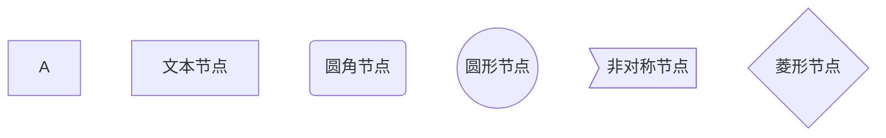
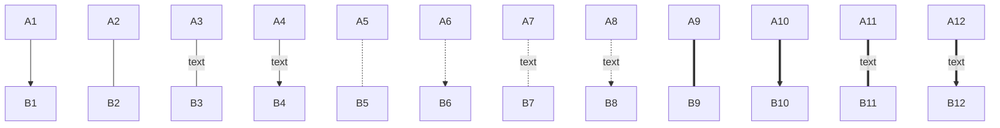
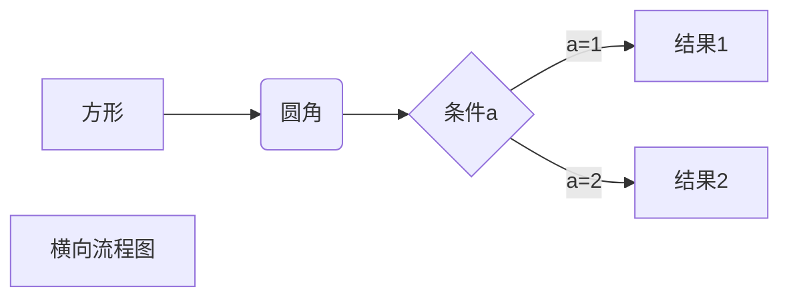
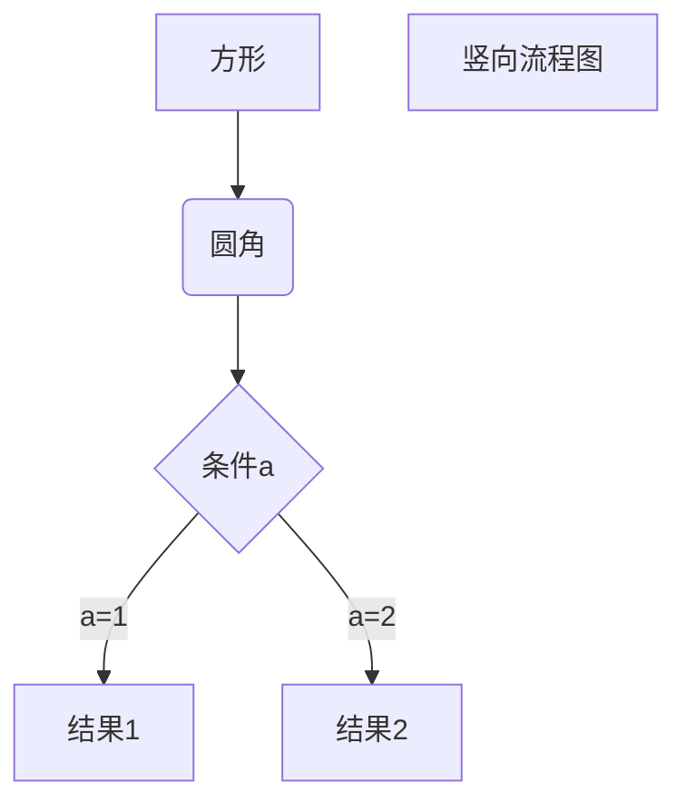
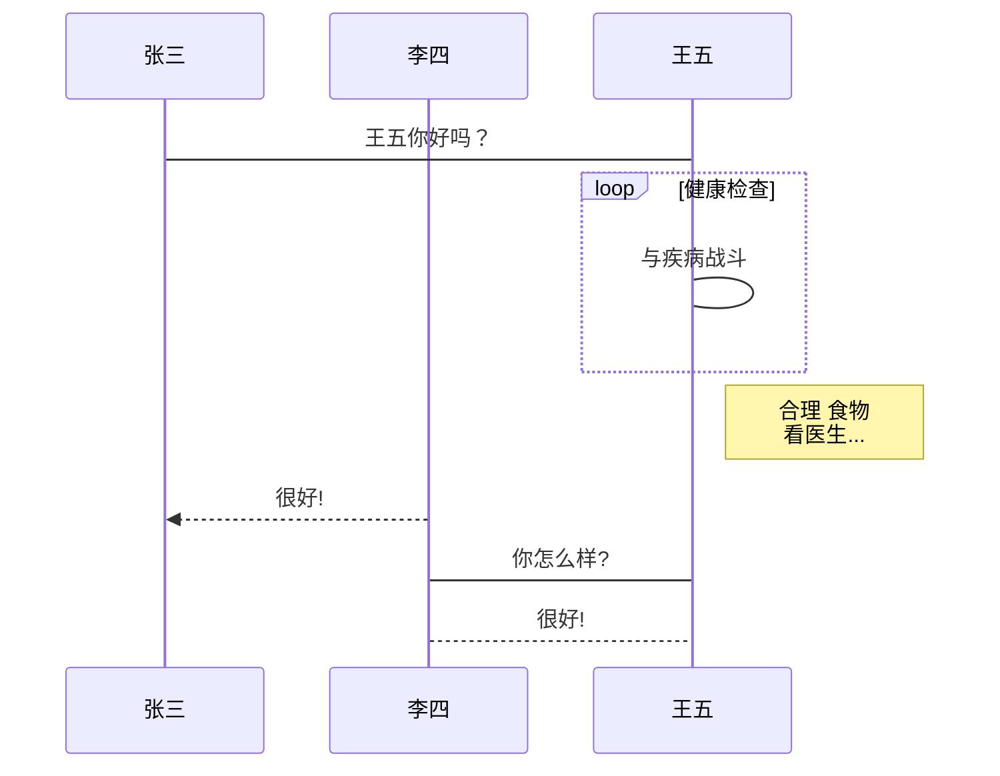
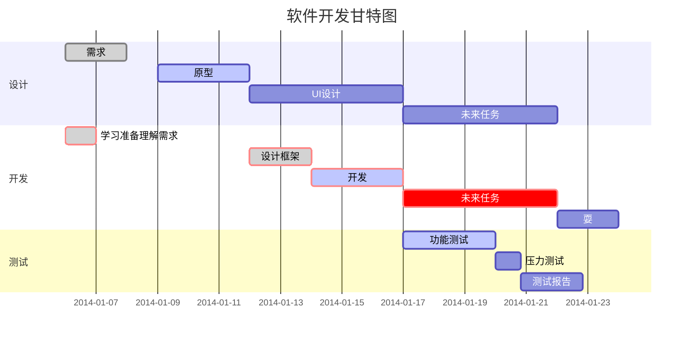

# Markdowns使用简明教程

## 1、目录的表示方法

# 目录1

## 目录2

### 目录3

#### 目录4

##### 目录5

###### 目录6

---

## 2、段落格式

*斜体*
**粗体**
***斜粗体***
~~删除线~~
<u>下划线</u>

脚注的使用
范冰冰。[^1]
[^1]:最美的女人

---
## 3、列表

### 无序列表
注意可以用‘+’、 ‘-’、 ‘*’ 号创建层级，注意符号和标题之间必须要有空格
嵌套层级之间有4个空格

+ 层级1

    + 层级1-1

        + 层级1-1-1

            + 层级1-1-1-1
            
+ 层级2
+ 层级3

### 有序列表

有序列表使用数字并加上 ‘.’号来表示，注意‘.’号和标题之间必须要有空格

1. 层级1
    + 层级1-1
        + 层级1-1-1
2. 层级2
3. 层级3

## 4、区块

>最外层
>>第二层嵌套
>>>第三层嵌套

区块中使用列表
>列表1
>+ 1-1
>   + 1-1-1

在列表中使用区块
+ >列表1 
    >1-1
    >1-2
+ >列表2 
    >2-1
    >2-2
## 5、代码

### 行内代码

python的`print()`函数怎么使用

### 代码块


### 多行代码
```py {cmd=python3  .line-numbers}
name = "小明"
print(name)
```

## 6、链接

[百度](www.baidu.com)


## 7、图片


## 8、表格

|左对齐|居中对齐|右对齐|
|:----|:----:|-----:|
|单元格|单元格|单元格|
|单元格|单元格|单元格|

## MarkDown 高级技巧

### 支持的 HTML 元素

不在 Markdown 涵盖范围之内的标签，都可以直接在文档里面用 HTML 撰写。

目前支持的 HTML 元素有：\<kbd\> \<b\> \<i\> \<em\> \<sup\> \<sub\> \<br\>等 ，如：
使用 <kbd>Ctrl</kbd>+<kbd>Alt</kbd>+<kbd>Del</kbd> 重启电脑

### 转义

Markdown 使用了很多特殊符号来表示特定的意义，如果需要显示特定的符号则需要使用转义字符，Markdown 使用反斜杠转义特殊字符：

>**文本加粗** 
>\*\* 正常显示星号 \*\*

Markdown 支持以下这些符号前面加上反斜杠来帮助插入普通的符号：

>\\   反斜线
\`   反引号
\*   星号
\_   下划线
\{}  花括号
\[]  方括号
\()  小括号
\#   井字号
\+   加号
\-   减号
\.   英文句点
\!   感叹号

### 公式

当你需要在编辑器中插入数学公式时，可以使用两个美元符 $$ 包裹 TeX 或 LaTeX 格式的数学公式来实现。提交后，问答和文章页会根据需要加载 Mathjax 对数学公式进行渲染。如：

$$
\mathbf{V}_1 \times \mathbf{V}_2 =  \begin{vmatrix} 
\mathbf{i} & \mathbf{j} & \mathbf{k} \\
\frac{\partial X}{\partial u} &  \frac{\partial Y}{\partial u} & 0 \\
\frac{\partial X}{\partial v} &  \frac{\partial Y}{\partial v} & 0 \\
\end{vmatrix}
$${step1}{\style{visibility:hidden}{(x+1)(x+1)}}
$$

### 流程图

#### 基本图形

默认节点 A
文本节点 B[bname]
圆角节点 C(cname)
圆形节点 D((dname))
非对称节点 E>ename]
菱形节点 F{fname}

#### 箭头



以下几个实例效果图如下：

>1、横向流程图源码格式：


>2、竖向流程图源码格式：


>3、标准流程图源码格式：

```flow
st=>start: 开始框
op=>operation: 处理框
cond=>condition: 判断框(是或否?)
sub1=>subroutine: 子流程
io=>inputoutput: 输入输出框
e=>end: 结束框
st->op->cond
cond(yes)->io->e
cond(no)->sub1(right)->op
```
4、标准流程图源码格式（横向）：

```flow
st=>start: 开始框
op=>operation: 处理框
cond=>condition: 判断框(是或否?)
sub1=>subroutine: 子流程
io=>inputoutput: 输入输出框
e=>end: 结束框
st(right)->op(right)->cond
cond(yes)->io(bottom)->e
cond(no)->sub1(right)->op
```
5、UML时序图源码样例：

```sequence
对象A->对象B: 对象B你好吗?（请求）
Note right of 对象B: 对象B的描述
Note left of 对象A: 对象A的描述(提示)
对象B-->对象A: 我很好(响应)
对象A->对象B: 你真的好吗？
```
6、UML时序图源码复杂样例：

```sequence
Title: 标题：复杂使用
对象A->对象B: 对象B你好吗?（请求）
Note right of 对象B: 对象B的描述
Note left of 对象A: 对象A的描述(提示)
对象B-->对象A: 我很好(响应)
对象B->小三: 你好吗
小三-->>对象A: 对象B找我了
对象A->对象B: 你真的好吗？
Note over 小三,对象B: 我们是朋友
participant C
Note right of C: 没人陪我玩
```
7、UML标准时序图样例：


8、甘特图样例：


效果图如下：